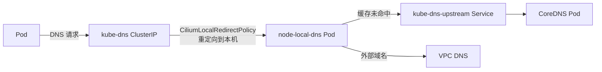
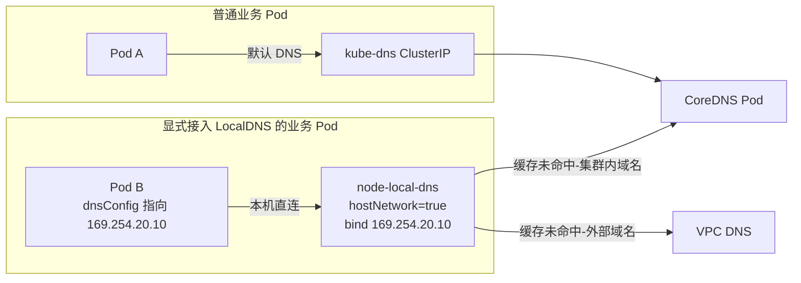

# DataPlaneV2 集群安装 NodeLocal DNSCache

## 背景

TKE 的 DataPlaneV2 集群使用 cilium eBPF 完全替代了 kube-proxy，Service 的负载均衡由 eBPF 在内核层直接完成，不经过 iptables。而 TKE 控制台提供的 [NodeLocalDNSCache 扩展组件](https://cloud.tencent.com/document/product/457/49423) 依赖 iptables 规则拦截 DNS 流量，因此**无法在 DataPlaneV2 集群中生效**。

当集群 DNS 出现性能瓶颈时（如高并发 DNS 查询、跨地域双活场景等），可以通过自建 NodeLocal DNSCache 并配合 CiliumLocalRedirectPolicy 来实现本地 DNS 缓存。

## 方案选择

本文提供两种部署方案，可按需选择：

| 方案                                  | 接入方式                                     | 适用场景                                                                                                        |
| ------------------------------------- | -------------------------------------------- | --------------------------------------------------------------------------------------------------------------- |
| **方案一：CiliumLocalRedirectPolicy** | 全集群默认接入，业务无感知                   | 集群整体 DNS QPS 高、想"装上即生效"全局加速；或集群内极少有 DNS 切换高可用敏感业务                              |
| **方案二：hostNetwork + dnsConfig**   | 业务显式接入（修改 workload 的 `dnsConfig`） | 仅想为部分高 QPS 业务加速；或集群内存在 DNS 切换高可用敏感业务（DB 主备切换、CLB 漂移、跨地域双活），需精细控制 |

两种方案使用各自独立的 `node-local-dns.yaml` 模板（在 `hostNetwork`、`setupinterface`、Corefile 绑定地址等关键参数上有差异），**互斥部署，不要同时启用**。

## 方案一：CiliumLocalRedirectPolicy

### 原理



工作流程：

1. Pod 发起 DNS 请求到 `kube-dns` 的 ClusterIP
2. Cilium 的 LocalRedirectPolicy 将请求重定向到**同节点**的 `node-local-dns` Pod
3. `node-local-dns` 优先查缓存，命中则直接返回
4. 缓存未命中时，集群内域名通过 `kube-dns-upstream` Service 转发到 CoreDNS；外部域名通过节点的 `/etc/resolv.conf` 转发到 VPC DNS

### 前提条件

- TKE DataPlaneV2 集群（VPC-CNI 网络模式 + cilium eBPF 数据面）
- cilium 已启用 LocalRedirectPolicy 功能且相关 CRD 已安装

确认方式：

```bash
# 确认 enable-local-redirect-policy 为 true
kubectl get cm -n kube-system cilium-config -o jsonpath='{.data.enable-local-redirect-policy}'
# 预期输出: true

# 确认 CRD 已安装
kubectl get crd ciliumlocalredirectpolicies.cilium.io
```

:::tip[说明]

DataPlaneV2 集群通常已默认满足以上条件，无需额外配置。如果输出不符合预期，请联系 TKE 支持。

:::

### 安装步骤

#### 1. 获取关键信息

```bash
# 获取 kube-dns 的 ClusterIP
kubedns=$(kubectl get svc kube-dns -n kube-system -o jsonpath={.spec.clusterIP})
echo "kube-dns ClusterIP: $kubedns"
```

#### 2. 部署 NodeLocal DNSCache

保存以下内容到文件 `node-local-dns.yaml`:

:::tip[说明]

以下部署 YAML 基于 Cilium 官方文档 [Node-local DNS cache](https://docs.cilium.io/en/stable/network/kubernetes/local-redirect-policy/#node-local-dns-cache) 中的 **Manual Configuration** 方式修改而来，关键调整包括：

- 使用 dockerhub mirror 镜像（TKE 环境内网可拉取）
- 禁用 HINFO 请求（VPC DNS 不支持）
- `hostNetwork: false`（使用 Pod 网络，配合 CiliumLocalRedirectPolicy）
- `-setupinterface=false -setupiptables=false`（不创建本地网络接口和 iptables 规则，完全依赖 cilium 重定向）

:::

<FileBlock file="networking/dpv2-node-local-dns-lrp.yaml" title="node-local-dns.yaml" />

替换占位符并安装：

```bash
# 获取 kube-dns-upstream 的 ClusterIP 作为集群内 DNS 转发目标
kubedns_upstream=$(kubectl get svc kube-dns-upstream -n kube-system -o jsonpath={.spec.clusterIP} 2>/dev/null)

# 如果 kube-dns-upstream 还不存在（首次安装），先 apply 创建 Service 再获取
if [ -z "$kubedns_upstream" ]; then
  kubectl apply -f node-local-dns.yaml
  kubedns_upstream=$(kubectl get svc kube-dns-upstream -n kube-system -o jsonpath={.spec.clusterIP})
fi

# 替换占位符
sed -i "s/__PILLAR__DNS__SERVER__/$kubedns/g" node-local-dns.yaml
sed -i "s/__PILLAR__DNS__DOMAIN__/cluster.local/g" node-local-dns.yaml
sed -i "s/__PILLAR__CLUSTER__DNS__/$kubedns_upstream/g" node-local-dns.yaml
sed -i "s/__PILLAR__UPSTREAM__SERVERS__/\/etc\/resolv.conf/g" node-local-dns.yaml

# 安装
kubectl apply -f node-local-dns.yaml
```

:::warning[重要]

`__PILLAR__CLUSTER__DNS__` **必须替换为 `kube-dns-upstream` Service 的 ClusterIP**（如 `192.168.x.x`），不能使用域名 `kube-dns-upstream.kube-system.svc.cluster.local`。

原因：`node-local-dns` Pod 使用 `dnsPolicy: Default`（使用节点 DNS 而非集群 DNS），无法解析集群内域名。如果使用域名作为 forward 目标，coredns forward 插件会报错 `not an IP address or file` 导致 Pod CrashLoopBackOff。

:::

#### 3. 创建 CiliumLocalRedirectPolicy

创建重定向策略，将发往 `kube-dns` 的 DNS 流量重定向到本机的 `node-local-dns` Pod：

```yaml title="localdns-redirect-policy.yaml"
apiVersion: cilium.io/v2
kind: CiliumLocalRedirectPolicy
metadata:
  name: nodelocaldns
  namespace: kube-system
spec:
  redirectFrontend:
    serviceMatcher:
      serviceName: kube-dns
      namespace: kube-system
  redirectBackend:
    localEndpointSelector:
      matchLabels:
        k8s-app: node-local-dns
    toPorts:
    - port: "53"
      name: dns
      protocol: UDP
    - port: "53"
      name: dns-tcp
      protocol: TCP
```

```bash
kubectl apply -f localdns-redirect-policy.yaml
```

#### 4. 验证

确认 `node-local-dns` Pod 运行正常：

```bash
kubectl get pod -n kube-system -l k8s-app=node-local-dns
```

预期输出所有 Pod 状态为 `Running` 且无 Restart。

创建测试 Pod 验证 DNS 解析：

```bash
kubectl run dnstest --image=busybox:1.36 --restart=Never -- sleep 3600
kubectl exec dnstest -- nslookup kubernetes.default.svc.cluster.local
kubectl exec dnstest -- nslookup www.baidu.com
```

查看 `node-local-dns` 的 metrics 确认请求被正确处理：

```bash
NODE_LOCAL_DNS_IP=$(kubectl get pod -n kube-system -l k8s-app=node-local-dns -o jsonpath='{.items[0].status.podIP}')
kubectl exec dnstest -- wget -qO- http://$NODE_LOCAL_DNS_IP:9253/metrics | grep coredns_dns_requests_total
```

如果有 `coredns_dns_requests_total` 指标且有 `cluster.local` zone 的计数，说明 DNS 流量已被成功重定向到 `node-local-dns`。

清理测试 Pod：

```bash
kubectl delete pod dnstest
```

### 与自建 Cilium 集群的差异

方案一依赖 cilium 的 LocalRedirectPolicy 能力，DPv2 集群与自建 Cilium 集群在该能力上的差异如下：

| 对比项              | 自建 Cilium 集群                                         | DataPlaneV2 集群                       |
| ------------------- | -------------------------------------------------------- | -------------------------------------- |
| LocalRedirectPolicy | 需手动启用（`--set localRedirectPolicies.enabled=true`） | 默认已启用                             |
| CRD                 | 需确认已安装                                             | 默认已安装                             |
| Cilium 部署形式     | 独立 DaemonSet                                           | sidecar 形式集成在 `tke-eni-agent` 中  |
| kube-proxy          | 需手动移除                                               | 不存在（创建时就不部署）               |
| 配置方式            | helm values 或 cilium-config ConfigMap                   | 不可直接修改（由 eniipamd addon 管理） |

自建 Cilium 集群的部署方式参考：[Cilium 与 Nodelocal DNSCache 共存（自建 Cilium 场景）](/networking/cilium/with-node-local-dns)。

### 高级配置：按域名分流（对 DNS 切换敏感的高可用场景）

#### 适用场景

部分业务依赖 **DNS 切换** 实现高可用，例如：

- **云数据库主备切换**：如 TencentDB MySQL/Redis 主实例故障时，控制台或主备探活会把读写域名解析到备实例
- **CLB VIP 漂移 / 跨可用区容灾**：用域名（而非固定 VIP）连接 CLB，故障时 DNS 指向新 VIP
- **跨地域双活切流**：通过 GSLB / 智能 DNS 把流量在地域间切换

这类场景下，**业务对域名切换的感知速度上限 = DNS 解析结果的 TTL**。引入 LocalDNS 后，node-local-dns 会按 Corefile 中 `cache` 插件的配置缓存响应：

- 如果 `cache` 配置的最大 TTL **大于权威 DNS 的 TTL**，会**额外放大切换延迟**
- 默认配置下 `success 9984 30`（最长 30s）对绝大多数场景够用，但 **对秒级 RTO 敏感的业务（如金融交易）需要更激进的策略**

解决思路：为这类高敏感域名单独写一个 server block，**不缓存或仅做请求合并**（1s 缓存），其它域名维持默认缓存以保留性能收益。

> 如果集群内此类高敏感业务较多，更推荐直接使用 [方案二](#方案二hostnetwork--dnsconfig-显式接入)，让这些业务保留默认 DNS 行为，其它业务再按需接入 LocalDNS。

#### 配置方法

编辑 `node-local-dns` ConfigMap，在 Corefile 中**新增一个 server block**（其余 block 保持不变）：

```bash
kubectl edit configmap node-local-dns -n kube-system
```

在 `.:53 { ... }` 这个 catch-all block **之前**插入：

```
tencentcdb.com:53 clb.tencentyun.com:53 {
    errors
    cache 1
    reload
    loop
    bind 0.0.0.0
    forward . /etc/resolv.conf
    prometheus :9253
    }
```

说明：

- **Zone 匹配最长前缀优先**：CoreDNS 会自动把 `xxx-db.tencentcdb.com` 路由到这个 block，不会落到 `.:53`
- **一个 block 可写多个 zone**，空格分隔；按需把自己业务的高敏感域名加进去
- **`cache 1`**：最大缓存 1 秒。比"完全不缓存"更推荐，原因是 CoreDNS cache 插件在缓存有效期内会**合并并发请求**，避免上游 VPC DNS 被打爆，1 秒延迟对 RTO 影响几乎可忽略
- 若需完全透传（每次都查上游），**删除 `cache 1` 这一行**即可
- **`prometheus :9253` 每个 block 都要写**，否则该 block 的 DNS 请求不会被纳入指标

修改后由 `reload` 插件自动加载（约 30 秒内生效），如需立即生效可手动重启：

```bash
kubectl rollout restart ds/node-local-dns -n kube-system
```

#### 验证

在业务 Pod 内连续解析目标域名，观察 TTL：

```bash
kubectl exec dnstest -- sh -c 'for i in 1 2 3; do dig +noall +answer your-db.tencentcdb.com; sleep 2; done'
```

- **高敏感域名（命中新 block）**：每次返回的 TTL 都是权威 DNS 的原始值，不会随时间递减
- **其它域名（命中 `.:53`）**：TTL 会随时间递减（说明命中了 LocalDNS 缓存）

## 方案二：hostNetwork + dnsConfig 显式接入

### 原理



工作流程：

1. 部署 `node-local-dns` 时使用 `hostNetwork: true`，并通过 `setupinterface=true` 在每个节点创建 dummy 网卡，绑定 link-local IP `169.254.20.10`
2. **不创建 CiliumLocalRedirectPolicy**，普通业务的 DNS 请求仍通过 kube-dns ClusterIP 走 CoreDNS（默认行为不变）
3. 需要本地缓存加速的业务在 workload 上显式配置 `dnsConfig`，把 nameserver 指向 `169.254.20.10`，请求由节点路由直达本机 node-local-dns
4. node-local-dns 缓存未命中时，集群内域名转发到 `kube-dns-upstream` Service 到 CoreDNS；外部域名转发到节点 VPC DNS

:::tip[为什么 DPv2 不需要 iptables 规则]

社区原版 NodeLocal DNSCache 使用 iptables 规则（NOTRACK + DNAT）劫持 `kube-dns` ClusterIP 流量。本方案中业务 Pod 的 nameserver **直接是 `169.254.20.10`**，不需要劫持 ClusterIP，因此 `setupiptables=false` 即可。link-local 地址也不会被 cilium eBPF 拦截，走节点原生路由。

:::

### 前提条件

- TKE DataPlaneV2 集群（VPC-CNI 网络模式 + cilium eBPF 数据面）

无需 LocalRedirectPolicy，比方案一前置条件更少。

### 安装步骤

#### 1. 获取关键信息

```bash
# 获取 kube-dns 的 ClusterIP（作为 dnsConfig 的兜底 nameserver）
kubedns=$(kubectl get svc kube-dns -n kube-system -o jsonpath={.spec.clusterIP})
echo "kube-dns ClusterIP: $kubedns"
```

#### 2. 部署 NodeLocal DNSCache

保存以下内容到文件 `node-local-dns.yaml`:

:::tip[与方案一 yaml 的关键差异]

本方案使用独立的 yaml 模板，与方案一相比的关键差异：

- `hostNetwork: true`（Pod 共享节点网络命名空间，便于绑定 link-local IP）
- `-setupinterface=true`（在节点创建 `nodelocaldns` dummy 网卡并绑定 `169.254.20.10`）
- `-localip "169.254.20.10,..."`（声明本地监听 IP）
- Corefile 中所有 server block 的 `bind` 改为 `169.254.20.10`（不绑 0.0.0.0，避免与节点其它 53 端口监听冲突）
- 容器端口 53/9253 配置 `hostPort`（由 hostNetwork 决定）
- livenessProbe 探测 `169.254.20.10:8080/health`（hostNetwork 下需显式指定 host）

:::

<FileBlock file="networking/dpv2-node-local-dns-hostnet.yaml" title="node-local-dns.yaml" />

替换占位符并安装：

```bash
# 获取 kube-dns-upstream 的 ClusterIP 作为集群内 DNS 转发目标
kubedns_upstream=$(kubectl get svc kube-dns-upstream -n kube-system -o jsonpath={.spec.clusterIP} 2>/dev/null)

# 如果 kube-dns-upstream 还不存在（首次安装），先 apply 创建 Service 再获取
if [ -z "$kubedns_upstream" ]; then
  kubectl apply -f node-local-dns.yaml
  kubedns_upstream=$(kubectl get svc kube-dns-upstream -n kube-system -o jsonpath={.spec.clusterIP})
fi

# 替换占位符
sed -i "s/__PILLAR__DNS__SERVER__/$kubedns/g" node-local-dns.yaml
sed -i "s/__PILLAR__DNS__DOMAIN__/cluster.local/g" node-local-dns.yaml
sed -i "s/__PILLAR__CLUSTER__DNS__/$kubedns_upstream/g" node-local-dns.yaml
sed -i "s/__PILLAR__UPSTREAM__SERVERS__/\/etc\/resolv.conf/g" node-local-dns.yaml

# 安装
kubectl apply -f node-local-dns.yaml
```

:::warning[不要创建 CiliumLocalRedirectPolicy]

方案二不需要 LocalRedirectPolicy。如果之前部署过方案一的 `nodelocaldns` LRP，请先删除：

```bash
kubectl delete ciliumlocalredirectpolicy nodelocaldns -n kube-system --ignore-not-found
```

否则会出现"全集群默认走 LocalDNS（方案一行为）"和"显式接入走 LocalDNS（方案二行为）"叠加的混乱状态。

:::

#### 3. 业务接入

在需要本地 DNS 缓存的 workload 上配置 `dnsConfig`，使用 `dnsPolicy: None` 完全接管 DNS 配置：

```yaml
spec:
  template:
    spec:
      dnsPolicy: None
      dnsConfig:
        nameservers:
          - 169.254.20.10                    # 优先：本机 LocalDNS
          - <kube-dns ClusterIP>             # 兜底：LocalDNS 异常时仍可解析
        searches:
          - <namespace>.svc.cluster.local    # 替换为业务所在 namespace
          - svc.cluster.local
          - cluster.local
        options:
          - name: ndots
            value: "5"
```

:::warning[必须用 `dnsPolicy: None`，不能用 ClusterFirst]

直觉上"保留默认 `ClusterFirst`、只在 `dnsConfig.nameservers` 里追加 `169.254.20.10`"看起来更省事，但**这种写法会让 LocalDNS 完全不生效**：

`ClusterFirst` 下 kubelet 把 `kube-dns` ClusterIP 注入到 `/etc/resolv.conf` 的 nameserver 列表**首位**，`dnsConfig.nameservers` 中的条目只会**追加到末尾**，且这个顺序无法通过 `dnsConfig` 调整。glibc resolver 默认按顺序使用第一个 nameserver，仅在超时（5s）后才 fallback 到下一个 —— 也就是说**正常情况下所有解析请求仍走 kube-dns，LocalDNS 只在 kube-dns 故障时才被用到**，加速效果完全失效。

所以方案二必须使用 `dnsPolicy: None`，把 `169.254.20.10` 显式放到 nameserver 列表第一位才能真正生效。

:::

:::warning[None 模式下 searches/ndots 必须手动列全]

`dnsPolicy: None` 时 kubelet **完全不注入** `searches` 和 `ndots`，必须自己写全：

- `<namespace>` 必须替换为业务实际所在 namespace，否则集群内短域名（如 `my-svc`）无法解析
- `ndots` 建议保持 `5`（与 ClusterFirst 默认值一致）；若需减少 search 域轮询可降到 `3`，但要确认所有依赖的域名解析仍正常

跨 namespace 部署同一份 yaml 时，建议通过 mutating webhook 动态注入正确的 namespace。

:::

:::tip[批量接入建议]

如果需要接入的业务较多，推荐通过 **mutating webhook** 根据 namespace label 或 Pod annotation 自动注入完整的 `dnsConfig`（含正确的 `searches`），避免逐个 workload 修改、也避免开发同学漏配 `searches` 导致集群内域名解析故障。

:::

#### 4. 验证

确认 node-local-dns Pod 运行正常，且节点上 dummy 网卡已创建：

```bash
# Pod 状态（注意 hostNetwork=true 后 Pod IP = 节点 IP）
kubectl get pod -n kube-system -l k8s-app=node-local-dns -o wide

# 在任意节点上确认 169.254.20.10 已绑定（替换为实际节点名）
kubectl debug node/<node-name> -it --image=busybox -- ip addr show | grep 169.254.20.10
```

部署一个接入了 `dnsConfig` 的测试 Pod 并验证：

```bash
kubectl run dnstest --image=busybox:1.36 --restart=Never \
  --overrides='{"spec":{"dnsPolicy":"None","dnsConfig":{"nameservers":["169.254.20.10"],"searches":["default.svc.cluster.local","svc.cluster.local","cluster.local"],"options":[{"name":"ndots","value":"3"}]}}}' \
  -- sleep 3600

kubectl exec dnstest -- nslookup kubernetes.default.svc.cluster.local
kubectl exec dnstest -- nslookup www.baidu.com

# 确认请求确实命中了本机的 node-local-dns
kubectl exec dnstest -- wget -qO- http://169.254.20.10:9253/metrics | grep coredns_dns_requests_total
```

如果 `coredns_dns_requests_total` 计数随解析次数递增，说明业务已成功接入本机 LocalDNS。

清理测试 Pod：

```bash
kubectl delete pod dnstest
```

## 参考资料

- [Local Redirect Policy Use Cases: Node-local DNS cache](https://docs.cilium.io/en/stable/network/kubernetes/local-redirect-policy/#node-local-dns-cache)
- [在 Kubernetes 集群中使用 NodeLocal DNSCache](https://kubernetes.io/zh-cn/docs/tasks/administer-cluster/nodelocaldns/)
- [Cilium 与 Nodelocal DNSCache 共存（自建 Cilium 场景）](/networking/cilium/with-node-local-dns)
