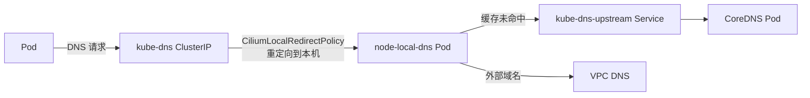

# DataPlaneV2 集群安装 NodeLocal DNSCache

## 背景

TKE 的 DataPlaneV2 集群使用 cilium eBPF 完全替代了 kube-proxy，通过 cilium 来处理 Service 的负载均衡。这意味着 TKE 控制台提供的 [NodeLocalDNSCache 扩展组件](https://cloud.tencent.com/document/product/457/49423) **不支持** DataPlaneV2 集群。

当集群 DNS 出现性能瓶颈时（如高并发 DNS 查询、跨地域双活场景等），可以通过自建 NodeLocal DNSCache 并配合 CiliumLocalRedirectPolicy 来实现本地 DNS 缓存。

## 原理



工作流程：

1. Pod 发起 DNS 请求到 `kube-dns` 的 ClusterIP
2. Cilium 的 LocalRedirectPolicy 将请求重定向到**同节点**的 `node-local-dns` Pod
3. `node-local-dns` 优先查缓存，命中则直接返回
4. 缓存未命中时，集群内域名通过 `kube-dns-upstream` Service 转发到 CoreDNS；外部域名通过节点的 `/etc/resolv.conf` 转发到 VPC DNS

## 前提条件

- TKE DataPlaneV2 集群（VPC-CNI 网络模式 + cilium eBPF 数据面）

:::tip[说明]

DataPlaneV2 集群已默认启用 `enable-local-redirect-policy: true` 并预装了 `ciliumlocalredirectpolicies.cilium.io` CRD，无需额外配置。

:::

## 安装步骤

### 1. 获取关键信息

```bash
# 获取 kube-dns 的 ClusterIP
kubedns=$(kubectl get svc kube-dns -n kube-system -o jsonpath={.spec.clusterIP})
echo "kube-dns ClusterIP: $kubedns"
```

### 2. 部署 NodeLocal DNSCache

保存以下内容到文件 `node-local-dns.yaml`:

:::tip[说明]

以下部署 YAML 基于 Cilium 官方文档 [Node-local DNS cache](https://docs.cilium.io/en/stable/network/kubernetes/local-redirect-policy/#node-local-dns-cache) 中的 **Manual Configuration** 方式修改而来，关键调整包括：

- 使用 dockerhub mirror 镜像（TKE 环境内网可拉取）
- 禁用 HINFO 请求（VPC DNS 不支持）
- `hostNetwork: false`（使用 Pod 网络，配合 CiliumLocalRedirectPolicy）
- `-setupinterface=false -setupiptables=false`（不创建本地网络接口和 iptables 规则，完全依赖 cilium 重定向）

:::

<FileBlock file="networking/dpv2-node-local-dns.yaml" title="node-local-dns.yaml" />

替换占位符并安装：

```bash
# 获取 kube-dns-upstream 的 ClusterIP 作为集群内 DNS 转发目标
kubedns_upstream=$(kubectl get svc kube-dns-upstream -n kube-system -o jsonpath={.spec.clusterIP} 2>/dev/null)

# 如果 kube-dns-upstream 还不存在（首次安装），先 apply 创建 Service 再获取
if [ -z "$kubedns_upstream" ]; then
  kubectl apply -f node-local-dns.yaml
  kubedns_upstream=$(kubectl get svc kube-dns-upstream -n kube-system -o jsonpath={.spec.clusterIP})
fi

# 替换占位符
sed -i "s/__PILLAR__DNS__SERVER__/$kubedns/g" node-local-dns.yaml
sed -i "s/__PILLAR__DNS__DOMAIN__/cluster.local/g" node-local-dns.yaml
sed -i "s/__PILLAR__CLUSTER__DNS__/$kubedns_upstream/g" node-local-dns.yaml
sed -i "s/__PILLAR__UPSTREAM__SERVERS__/\/etc\/resolv.conf/g" node-local-dns.yaml

# 安装
kubectl apply -f node-local-dns.yaml
```

:::warning[重要]

`__PILLAR__CLUSTER__DNS__` **必须替换为 `kube-dns-upstream` Service 的 ClusterIP**（如 `192.168.x.x`），不能使用域名 `kube-dns-upstream.kube-system.svc.cluster.local`。

原因：`node-local-dns` Pod 使用 `dnsPolicy: Default`（使用节点 DNS 而非集群 DNS），无法解析集群内域名。如果使用域名作为 forward 目标，coredns forward 插件会报错 `not an IP address or file` 导致 Pod CrashLoopBackOff。

:::

### 3. 创建 CiliumLocalRedirectPolicy

创建重定向策略，将发往 `kube-dns` 的 DNS 流量重定向到本机的 `node-local-dns` Pod：

```yaml title="localdns-redirect-policy.yaml"
apiVersion: cilium.io/v2
kind: CiliumLocalRedirectPolicy
metadata:
  name: nodelocaldns
  namespace: kube-system
spec:
  redirectFrontend:
    serviceMatcher:
      serviceName: kube-dns
      namespace: kube-system
  redirectBackend:
    localEndpointSelector:
      matchLabels:
        k8s-app: node-local-dns
    toPorts:
    - port: "53"
      name: dns
      protocol: UDP
    - port: "53"
      name: dns-tcp
      protocol: TCP
```

```bash
kubectl apply -f localdns-redirect-policy.yaml
```

### 4. 验证

确认 `node-local-dns` Pod 运行正常：

```bash
kubectl get pod -n kube-system -l k8s-app=node-local-dns
```

预期输出所有 Pod 状态为 `Running` 且无 Restart。

创建测试 Pod 验证 DNS 解析：

```bash
kubectl run dnstest --image=busybox:1.36 --restart=Never -- sleep 3600
kubectl exec dnstest -- nslookup kubernetes.default.svc.cluster.local
kubectl exec dnstest -- nslookup www.baidu.com
```

查看 `node-local-dns` 的 metrics 确认请求被正确处理：

```bash
NODE_LOCAL_DNS_IP=$(kubectl get pod -n kube-system -l k8s-app=node-local-dns -o jsonpath='{.items[0].status.podIP}')
kubectl exec dnstest -- wget -qO- http://$NODE_LOCAL_DNS_IP:9253/metrics | grep coredns_dns_requests_total
```

如果有 `coredns_dns_requests_total` 指标且有 `cluster.local` zone 的计数，说明 DNS 流量已被成功重定向到 `node-local-dns`。

清理测试 Pod：

```bash
kubectl delete pod dnstest
```

## 与自建 Cilium 集群的差异

| 对比项              | 自建 Cilium 集群                                         | DataPlaneV2 集群                       |
| ------------------- | -------------------------------------------------------- | -------------------------------------- |
| LocalRedirectPolicy | 需手动启用（`--set localRedirectPolicies.enabled=true`） | 默认已启用                             |
| CRD                 | 需确认已安装                                             | 默认已安装                             |
| Cilium 部署形式     | 独立 DaemonSet                                           | sidecar 形式集成在 `tke-eni-agent` 中  |
| kube-proxy          | 需手动移除                                               | 不存在（创建时就不部署）               |
| 配置方式            | helm values 或 cilium-config ConfigMap                   | 不可直接修改（由 eniipamd addon 管理） |

## 参考资料

- [Local Redirect Policy Use Cases: Node-local DNS cache](https://docs.cilium.io/en/stable/network/kubernetes/local-redirect-policy/#node-local-dns-cache)
- [在 Kubernetes 集群中使用 NodeLocal DNSCache](https://kubernetes.io/zh-cn/docs/tasks/administer-cluster/nodelocaldns/)
- [Cilium 与 Nodelocal DNSCache 共存（自建 Cilium 场景）](/networking/cilium/with-node-local-dns)
