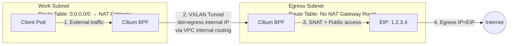

# Egress Gateway Best Practices

## Overview

This article covers how to use Cilium's Egress Gateway and CiliumEgressGatewayPolicy to flexibly control which external traffic uses which egress IP.

## Known Issues

Using Cilium's Egress Gateway has the following known issues:

1. Delay in applying Egress policy to new Pods. After a new Pod starts, if it matches an Egress policy, the traffic is expected to go through the designated egress gateway. However, the policy may not take effect immediately after the Pod starts. This period is usually short and does not affect most scenarios.
2. Incompatible with Cilium Cluster Mesh and CiliumEndpointSlice features.

## Enabling Egress Gateway

The following conditions must be met to enable Egress Gateway:

1. Enable cilium to replace kube-proxy.
2. Enable IP masquerade using BPF implementation instead of the default iptables implementation.
3. **VPC-CNI Native Routing mode only**: Must configure `ipMasqAgent.config.nonMasqueradeCIDRs` to cover all VPC CIDR blocks (primary + all auxiliary CIDRs). Otherwise, cross-node Pod-to-Pod traffic will be incorrectly SNATed by BPF masquerade to node IPs or link-local addresses. The destination node will not be able to restore the SNATed source IP back to the original Pod's cilium identity, causing **cross-node NetworkPolicy to fail**.

:::tip[Overlay mode is not affected]

In Overlay mode (VPC-CNI / GR), cross-node Pod-to-Pod traffic uses vxlan encapsulation. The outer layer is the node IP, and the inner Pod IP is preserved as-is. BPF masquerade only applies to the **outermost layer**, which exits the node's physical NIC, and cannot see the inner Pod IP. Therefore, `nonMasqueradeCIDRs` is not needed.

All content related to `nonMasqueradeCIDRs` (script interaction, helm parameters, selection rationale) below **applies only to Native Routing scenarios**.

:::

### One-Click Enable

Use the script to enable Egress Gateway with one command (automatically handles helm upgrade and component restart):

```bash
bash -c "$(curl -sfL https://raw.githubusercontent.com/imroc/tke-guide/main/static/scripts/cilium.sh)" -- enable-egress-gateway
```

If GitHub is not accessible, use the site address:

```bash
bash -c "$(curl -sfL https://imroc.cc/tke/scripts/cilium.sh)" -- enable-egress-gateway
```

:::tip[Script auto-handles nonMasqueradeCIDRs on Native Routing clusters]

When running `enable-egress-gateway` on a VPC-CNI Native Routing cluster, the script automatically determines `nonMasqueradeCIDRs` with the following priority:

1. Environment variable `NON_MASQ_CIDRS="10.0.0.0/8 172.16.0.0/12 ..."` (space-separated) — suitable for non-interactive scenarios (CI / Terraform)
2. Automatically reuse the TKE cluster's built-in `kube-system/ip-masq-agent-config` ConfigMap (TKE writes the VPC primary + auxiliary CIDRs into it when installing the plugin)
3. Interactive prompt (defaults to all three RFC 1918 CIDRs `10.0.0.0/8 172.16.0.0/12 192.168.0.0/16`, can be overridden with any valid Tencent Cloud VPC configuration)

On Overlay clusters, the script will not ask about or inject this configuration.

:::

### Manual Enable

Choose the appropriate method based on the routing mode of your current cilium installation:

<Tabs>
  <TabItem value="native" label="Native Routing (VPC-CNI)" default>

Cilium installation method for enabling Egress Gateway (highlighted lines are additions/modifications compared to the default installation):

```bash showLineNumbers
helm upgrade --install cilium cilium/cilium --version 1.19.4 \
  --namespace kube-system \
  --set image.repository=quay.tencentcloudcr.com/cilium/cilium \
  --set envoy.image.repository=quay.tencentcloudcr.com/cilium/cilium-envoy \
  --set operator.image.repository=quay.tencentcloudcr.com/cilium/operator \
  --set certgen.image.repository=quay.tencentcloudcr.com/cilium/certgen \
  --set hubble.relay.image.repository=quay.tencentcloudcr.com/cilium/hubble-relay \
  --set hubble.ui.backend.image.repository=quay.tencentcloudcr.com/cilium/hubble-ui-backend \
  --set hubble.ui.frontend.image.repository=quay.tencentcloudcr.com/cilium/hubble-ui \
  --set nodeinit.image.repository=quay.tencentcloudcr.com/cilium/startup-script \
  --set preflight.image.repository=quay.tencentcloudcr.com/cilium/cilium \
  --set preflight.envoy.image.repository=quay.tencentcloudcr.com/cilium/cilium-envoy \
  --set clustermesh.apiserver.image.repository=quay.tencentcloudcr.com/cilium/clustermesh-apiserver \
  --set authentication.mutual.spire.install.agent.image.repository=docker.io/k8smirror/spire-agent \
  --set authentication.mutual.spire.install.server.image.repository=docker.io/k8smirror/spire-server \
  --set operator.tolerations[0].key="node-role.kubernetes.io/control-plane",operator.tolerations[0].operator="Exists" \
  --set operator.tolerations[1].key="node-role.kubernetes.io/master",operator.tolerations[1].operator="Exists" \
  --set operator.tolerations[2].key="node.kubernetes.io/not-ready",operator.tolerations[2].operator="Exists" \
  --set operator.tolerations[3].key="node.cloudprovider.kubernetes.io/uninitialized",operator.tolerations[3].operator="Exists" \
  --set operator.tolerations[4].key="tke.cloud.tencent.com/uninitialized",operator.tolerations[4].operator="Exists" \
  --set operator.tolerations[5].key="tke.cloud.tencent.com/eni-ip-unavailable",operator.tolerations[5].operator="Exists" \
  --set routingMode=native \
  --set endpointRoutes.enabled=true \
  --set ipam.mode=delegated-plugin \
  --set devices=eth+ \
  --set cni.chainingMode=generic-veth \
  --set cni.customConf=true \
  --set cni.configMap=cni-config \
  --set cni.externalRouting=true \
  --set extraConfig.local-router-ipv4=169.254.32.16 \
  --set localRedirectPolicies.enabled=true \
  --set sysctlfix.enabled=false \
  # highlight-add-start
  --set kubeProxyReplacement=true \
  --set k8sServiceHost=$(kubectl get ep kubernetes -n default -o jsonpath='{.subsets[0].addresses[0].ip}') \
  --set k8sServicePort=60002 \
  --set egressGateway.enabled=true \
  --set enableIPv4Masquerade=true \
  --set bpf.masquerade=true \
  --set ipMasqAgent.enabled=true \
  --set ipMasqAgent.config.masqLinkLocal=true \
  --set ipMasqAgent.config.nonMasqueradeCIDRs[0]=10.0.0.0/8 \
  --set ipMasqAgent.config.nonMasqueradeCIDRs[1]=172.16.0.0/12 \
  --set ipMasqAgent.config.nonMasqueradeCIDRs[2]=192.168.0.0/16
  # highlight-add-end
```

Then restart cilium components to apply:

```bash
kubectl rollout restart ds cilium -n kube-system
kubectl rollout restart deploy cilium-operator -n kube-system
```

:::tip[About nonMasqueradeCIDRs values]

`ipMasqAgent.config.nonMasqueradeCIDRs` must **cover all VPC CIDR blocks** (primary + all auxiliary CIDRs, including node subnets and VPC-CNI Pod subnets). The example above uses all three [RFC 1918](https://datatracker.ietf.org/doc/html/rfc1918) CIDRs as a catch-all, which covers any valid Tencent Cloud VPC configuration — the simplest approach.

If you want to specify exactly, you can get the values directly from the TKE cluster's built-in `kube-system/ip-masq-agent-config` ConfigMap (TKE automatically writes VPC primary + auxiliary CIDRs when installing the ip-masq-agent plugin):

```bash
kubectl -n kube-system get cm ip-masq-agent-config -o jsonpath='{.data.config}'
```

:::

:::tip[If using the default installation]

If you have already installed cilium using the method in [Installing Cilium](install.md) (Using Helm to Install Cilium), the command for enabling Egress Gateway can be simplified:

```bash
helm upgrade cilium cilium/cilium --version 1.19.4 \
  --namespace kube-system \
  --reuse-values \
  --set egressGateway.enabled=true \
  --set enableIPv4Masquerade=true \
  --set bpf.masquerade=true \
  --set ipMasqAgent.enabled=true \
  --set ipMasqAgent.config.masqLinkLocal=true \
  --set ipMasqAgent.config.nonMasqueradeCIDRs[0]=10.0.0.0/8 \
  --set ipMasqAgent.config.nonMasqueradeCIDRs[1]=172.16.0.0/12 \
  --set ipMasqAgent.config.nonMasqueradeCIDRs[2]=192.168.0.0/16
```

:::

:::tip[Why use ipMasqAgent.config.nonMasqueradeCIDRs instead of ipv4NativeRoutingCIDR?]

Cilium provides two ways to tell BPF masquerade which traffic should not be SNATed:

| Configuration                         | Type       | Sufficient?                                                                                           |
| -------------------------------------- | ---------- | ----------------------------------------------------------------------------------------------------- |
| `ipv4NativeRoutingCIDR`                | Single CIDR | ❌ No. Tencent Cloud VPC supports "primary CIDR + multiple auxiliary CIDRs". VPC-CNI Pods can be assigned IPs from any CIDR, and a single CIDR cannot express this. |
| `ipMasqAgent.config.nonMasqueradeCIDRs` | CIDR list  | ✅ Can list all VPC CIDR blocks. The TKE built-in ip-masq-agent plugin uses the same field, so the configuration can be reused directly. |

Therefore, Native Routing + Egress Gateway must use `nonMasqueradeCIDRs`. This guide uses this as the standard for all Native + Egress scenarios.

:::

  </TabItem>
  <TabItem value="overlay" label="Overlay (VPC-CNI / GR)">

In Overlay mode, cilium already defaults to `enableIPv4Masquerade=true`, and cross-node Pod-to-Pod traffic uses vxlan encapsulation, which is not affected by BPF masquerade. Therefore, **no `nonMasqueradeCIDRs` configuration is needed or should be added**. On an Overlay cluster already installed with the default method from this guide, the command for enabling Egress Gateway is simplified to:

```bash
helm upgrade cilium cilium/cilium --version 1.19.4 \
  --namespace kube-system \
  --reuse-values \
  --set egressGateway.enabled=true \
  --set bpf.masquerade=true \
  --set ipMasqAgent.enabled=true \
  --set ipMasqAgent.config.masqLinkLocal=true
```

Then restart cilium components to apply:

```bash
kubectl rollout restart ds cilium -n kube-system
kubectl rollout restart deploy cilium-operator -n kube-system
```

  </TabItem>
</Tabs>

## Creating Egress Nodes

You can create a node pool as the Egress node pool. Later, you can configure certain Pods to have their outbound traffic go through these nodes. For creation instructions, refer to the **Creating a Node Pool** section in [Installing Cilium](install.md).

Important notes:

1. Label the nodes created by the node pool (e.g., `egress-node=true`) to identify them for Egress Gateway.
2. If public network access is needed, assign public IPs to the nodes.
3. If you do not want regular Pods to be scheduled on these nodes, add taints.
4. Egress node pools typically do not enable auto-scaling; use a fixed number of nodes.
5. If you need to coexist with a NAT gateway (some Pods go through NAT gateway, others through Egress nodes), the egress node pool should use a **separate subnet** whose route table does not configure a NAT gateway route. See the FAQ [How to make Egress Gateway coexist with NAT gateway?](#how-to-make-egress-gateway-coexist-with-nat-gateway) for details.

Below are specific considerations for creating node pools.

<Tabs>
  <TabItem value="1" label="Native Node Pool">

If creating via the console, make sure to check **Create Elastic Public IP**:


Add Labels and Taints (optional):


If creating via Terraform, refer to the following code snippet:

```hcl showLineNumbers
resource "tencentcloud_kubernetes_native_node_pool" "cilium" {
  name       = "cilium"
  cluster_id = tencentcloud_kubernetes_cluster.tke_cluster.id
  type       = "Native"
  annotations {
    name  = "node.tke.cloud.tencent.com/beta-image"
    value = "ts4-public"
  }
  # highlight-add-start
  # Label the scaled-out nodes
  labels {
    name = "egress-node"
    value = "true"
  }
  # (Optional) Taint nodes to prevent regular Pods from being scheduled on Egress nodes
  taints {
    key    = "egress-node"
    effect = "NoSchedule"
    value  = "true"
  }
  # highlight-add-end
  native {
    # highlight-add-start
    # Set the number of egress node replicas
    replicas = 1
    internet_accessible {
      # Pay by traffic
      charge_type       = "TRAFFIC_POSTPAID_BY_HOUR"
      # Maximum outbound bandwidth 100Mbps
      max_bandwidth_out = 100
    }
    # highlight-add-end
    # Omit other necessary but unrelated configuration
  }
```

  </TabItem>
  <TabItem value="2" label="Ordinary Node Pool">

If creating via the console, make sure to check **Assign Free Public IP**:


Add Labels and Taints (optional):


If creating via Terraform, refer to the following code snippet:

```hcl showLineNumbers
resource "tencentcloud_kubernetes_node_pool" "cilium" {
  name              = "cilium"
  cluster_id        = tencentcloud_kubernetes_cluster.tke_cluster.id
  node_os           = "img-gqmik24x" # TencentOS 4, requires whitelist for ordinary node pools
  enable_auto_scale = false # Disable auto-scaling
  desired_capacity  = 3 # Set egress node count

  auto_scaling_config {
    # highlight-add-start
    # Pay by traffic
    internet_charge_type       = "TRAFFIC_POSTPAID_BY_HOUR"
    # Maximum outbound bandwidth
    internet_max_bandwidth_out = 100
    # Assign free public IP
    public_ip_assigned         = true
    # highlight-add-end
    # Omit other necessary but unrelated configuration
  }

  # highlight-add-start
  labels = {
    # Label the scaled-out nodes
    "egress-node" = "true"
  }
  # highlight-add-end

  # (Optional) Taint nodes to prevent regular Pods from being scheduled on Egress nodes
  taints {
    key    = "egress-node"
    effect = "NoSchedule"
    value  = "true"
  }
```

  </TabItem>
  <TabItem value="3" label="Karpenter Node Pool">
  
  Configure node public network in `TKEMachineNodeClass`, and node labels in `NodePool`:

```yaml showLineNumbers
apiVersion: karpenter.sh/v1
kind: NodePool
metadata:
  name: default
spec:
  disruption:
    consolidationPolicy: WhenEmptyOrUnderutilized
    consolidateAfter: 5m
    budgets:
    - nodes: 10%
  template:
    metadata:
      annotations:
        beta.karpenter.k8s.tke.machine.spec/annotations: node.tke.cloud.tencent.com/beta-image=ts4-public
      # highlight-add-start
      # Label the scaled-out nodes
      labels:
        egress-node: "true"
      # (Optional) Taint nodes to prevent regular Pods from being scheduled on Egress nodes
      taints:
      - key: egress-node
        effect: NoSchedule
        value: "true"
      # highlight-add-end
    spec:
      requirements:
      - key: kubernetes.io/arch
        operator: In
        values: ["amd64"]
      - key: kubernetes.io/os
        operator: In
        values: ["linux"]
      - key: karpenter.k8s.tke/instance-family
        operator: In
        values: ["S5", "SA2", "SA5"]
      - key: karpenter.sh/capacity-type
        operator: In
        values: ["on-demand"]
      - key: "karpenter.k8s.tke/instance-cpu"
        operator: Gt
        values: ["1"]
      nodeClassRef:
        group: karpenter.k8s.tke
        kind: TKEMachineNodeClass
        name: default
  limits:
    cpu: 100
---
apiVersion: karpenter.k8s.tke/v1beta1
kind: TKEMachineNodeClass
metadata:
  name: default
spec:
  # highlight-add-start
  internetAccessible:
    chargeType: TrafficPostpaidByHour # Pay by traffic
    maxBandwidthOut: 100 # Maximum outbound bandwidth 100Mbps
  # highlight-add-end
  subnetSelectorTerms:
  - id: subnet-12sxk3z4
  - id: subnet-b8qyi2dk
  securityGroupSelectorTerms:
  - id: sg-nok01xpa
  sshKeySelectorTerms:
  - id: skey-3t01mlvf
```

  </TabItem>
</Tabs>

After the node pool is created and nodes are initialized, check which nodes are egress nodes and their public IPs:

```bash
$ kubectl get nodes -o wide -l egress-node=true
NAME            STATUS   ROLES    AGE     VERSION         INTERNAL-IP     EXTERNAL-IP      OS-IMAGE               KERNEL-VERSION           CONTAINER-RUNTIME
172.22.48.125   Ready    <none>   3h17m   v1.32.2-tke.6   172.22.48.125   43.134.181.245   TencentOS Server 4.4   6.6.98-40.2.tl4.x86_64   containerd://1.6.9-tke.8
172.22.48.48    Ready    <none>   3h17m   v1.32.2-tke.6   172.22.48.48    43.156.74.191    TencentOS Server 4.4   6.6.98-40.2.tl4.x86_64   containerd://1.6.9-tke.8
172.22.48.64    Ready    <none>   3h17m   v1.32.2-tke.6   172.22.48.64    43.134.178.226   TencentOS Server 4.4   6.6.98-40.2.tl4.x86_64   containerd://1.6.9-tke.8
```

## Configuring CiliumEgressGatewayPolicy

Configure `CiliumEgressGatewayPolicy` to flexibly define which Pods' traffic goes through which gateway's egress IP to leave the cluster. For configuration instructions, refer to the official documentation [Writing egress gateway policies](https://docs.cilium.io/en/stable/network/egress-gateway/egress-gateway/#writing-egress-gateway-policies).

## Use Cases

### External Traffic Through a Fixed Egress Node

If you want external traffic to go through a fixed Egress node (when accessing the public network, the source IP will be fixed to the public IP bound to the Egress node), configure as follows.

Deploy an `nginx` workload:

```yaml
apiVersion: apps/v1
kind: Deployment
metadata:
  name: nginx
  namespace: default
spec:
  replicas: 1
  selector:
    matchLabels:
      app: nginx
  template:
    metadata:
      labels:
        app: nginx
    spec:
      containers:
      - name: nginx
        image: nginx:latest
```

Configure `CiliumEgressGatewayPolicy` to specify that this workload uses a designated egress node to access the public network:

```yaml
apiVersion: cilium.io/v2
kind: CiliumEgressGatewayPolicy
metadata:
  name: egress-test
spec:
  selectors:
  - podSelector: # Specify which Pods this egress policy applies to
      matchLabels:
        app: nginx # Pods with app=nginx label
        io.kubernetes.pod.namespace: default # Specify default namespace
  destinationCIDRs:
  - "0.0.0.0/0"
  - "::/0"
  egressGateway:
    nodeSelector:
      matchLabels:
        kubernetes.io/hostname: 172.22.49.119 # egress node name
    # Important: In TKE environments, you must use the egress node's internal IP here.
    # This determines the source IP used when the egress node forwards external traffic.
    # Whether forwarding internal or public traffic, the source IP leaving the egress node
    # will be the node's internal IP.
    egressIP: 172.22.49.119
```

Check the egress node:

```bash
$ kubectl get nodes -o wide 172.22.49.119
NAME            STATUS   ROLES    AGE   VERSION         INTERNAL-IP     EXTERNAL-IP    OS-IMAGE               KERNEL-VERSION           CONTAINER-RUNTIME
172.22.49.119   Ready    <none>   69m   v1.32.2-tke.6   172.22.49.119   129.226.84.9   TencentOS Server 4.4   6.6.98-40.2.tl4.x86_64   containerd://1.6.9-tke.8
```

The node's public IP is `129.226.84.9`. Enter the Pod and verify the current egress IP:

```bash
$ kubectl -n default exec -it deployment/nginx -- curl ifconfig.me
129.226.84.9
```

The egress IP is `129.226.84.9`, as expected.

### External Traffic Through a Group of Egress Nodes

If you want external traffic to go through a fixed group of Egress nodes (when accessing the public network, the source IP will be one of the public IPs bound to the Egress nodes), configure as follows.

Deploy an `nginx` workload:

```yaml
apiVersion: apps/v1
kind: Deployment
metadata:
  name: nginx
  namespace: default
spec:
  replicas: 10
  selector:
    matchLabels:
      app: nginx
  template:
    metadata:
      labels:
        app: nginx
    spec:
      containers:
      - name: nginx
        image: nginx:latest
```

Configure `CiliumEgressGatewayPolicy` to specify that this workload routes external traffic through a group of Egress nodes:

```yaml
apiVersion: cilium.io/v2
kind: CiliumEgressGatewayPolicy
metadata:
  name: egress-test
spec:
  selectors:
  - podSelector: # Specify which Pods this egress policy applies to
      matchLabels:
        app: nginx # Pods with app=nginx label
        io.kubernetes.pod.namespace: default # Specify namespace
  destinationCIDRs:
  - "0.0.0.0/0"
  - "::/0"
  egressGateway: # This field is required. If specifying multiple egress nodes, you must still specify one here; otherwise, you'll get: spec.egressGateway: Required value
    nodeSelector:
      matchLabels:
        kubernetes.io/hostname: 172.22.49.20 # egress node name
    egressIP: 172.22.49.20 # egress node internal IP
  egressGateways: # Additional egress nodes appended to this list
  - nodeSelector:
      matchLabels:
        kubernetes.io/hostname: 172.22.49.147
    egressIP: 172.22.49.147
  - nodeSelector:
      matchLabels:
        kubernetes.io/hostname: 172.22.49.119
    egressIP: 172.22.49.119
```

Testing shows that different Pods in the workload may use different egress public IPs:

```bash
$ kubectl get pods -o jsonpath='{range .items[*]}{.metadata.name}{"\n"}{end}' | xargs -I {} sh -c 'kubectl exec -n default -it {} -- curl -s ifconfig.me 2>/dev/null || echo "Failed"; printf ":\t%s\n" "{}"'
129.226.84.9:   nginx-54c98b4f84-5wlpc
43.156.123.70:  nginx-54c98b4f84-6jx8n
43.156.123.70:  nginx-54c98b4f84-82wmq
129.226.84.9:   nginx-54c98b4f84-8ptvh
129.226.84.9:   nginx-54c98b4f84-jfr2x
129.226.84.9:   nginx-54c98b4f84-jlrr7
43.156.123.70:  nginx-54c98b4f84-mpvpz
129.226.84.9:   nginx-54c98b4f84-s7q4s
43.156.123.70:  nginx-54c98b4f84-vsnng
43.156.123.70:  nginx-54c98b4f84-xt8bs
```

All egress IPs belong to the defined group of egress nodes:

```bash
$ kubectl get nodes -o custom-columns="NAME:.metadata.name,EXTERNAL-IP:.status.addresses[?(@.type=='ExternalIP')].address" -l egress-node=true
NAME            EXTERNAL-IP
172.22.49.119   129.226.84.9
172.22.49.147   43.156.123.70
172.22.49.20    43.163.1.23
```

### All External Cluster Traffic Through Egress Nodes

To route all external traffic from all Pods in the cluster through Egress nodes, use `podSelector: {}` to select all Pods:

```yaml showLineNumbers
apiVersion: cilium.io/v2
kind: CiliumEgressGatewayPolicy
metadata:
  name: egress-test
spec:
  # highlight-add-start
  selectors:
  - podSelector: {} # Select all Pods in the cluster
  # highlight-add-end
  destinationCIDRs:
  - "0.0.0.0/0"
  - "::/0"
  egressGateway: # This field is required. If specifying multiple egress nodes, you must still specify one here; otherwise, you'll get: spec.egressGateway: Required value
    nodeSelector:
      matchLabels:
        kubernetes.io/hostname: 172.22.49.20 # egress node name
    egressIP: 172.22.49.20 # egress node internal IP
  egressGateways: # Additional egress nodes appended to this list
  - nodeSelector:
      matchLabels:
        kubernetes.io/hostname: 172.22.49.147
    egressIP: 172.22.49.147
  - nodeSelector:
      matchLabels:
        kubernetes.io/hostname: 172.22.49.119
    egressIP: 172.22.49.119
```

### Different Environments or Workloads Through Different Egress Nodes

If different environments or workloads are separated by namespaces, you can specify that Pods in a particular namespace route external traffic through designated Egress nodes:

```yaml showLineNumbers
apiVersion: cilium.io/v2
kind: CiliumEgressGatewayPolicy
metadata:
  name: egress-test
spec:
  selectors:
  - podSelector:
      matchLabels:
        # highlight-add-line
        io.kubernetes.pod.namespace: prod # All Pods in the prod namespace
  destinationCIDRs:
  - "0.0.0.0/0"
  - "::/0"
  egressGateway:
    nodeSelector:
      matchLabels:
        kubernetes.io/hostname: 172.22.49.119
    egressIP: 172.22.49.119
```

If you use labels to distinguish different workloads, specify that Pods with a particular label route external traffic through designated Egress nodes:

```yaml
apiVersion: cilium.io/v2
kind: CiliumEgressGatewayPolicy
metadata:
  name: egress-test
spec:
  selectors:
  - podSelector:
      matchLabels:
        # highlight-add-line
        business: mall # All Pods with business=mall label
  destinationCIDRs:
  - "0.0.0.0/0"
  - "::/0"
  egressGateway:
    nodeSelector:
      matchLabels:
        kubernetes.io/hostname: 172.22.49.119
    egressIP: 172.22.49.119
```

## FAQ

### Network Unreachable After Configuring Policy

First, verify the CiliumEgressGatewayPolicy configuration. In TKE environments, ensure that `egressGateway.nodeSelector` selects only one node, and `egressIP` must be set to that node's internal IP. Otherwise, connectivity issues may occur.

You can also log into the cilium pod on the egress node and run `cilium-dbg bpf egress list` to check the egress BPF rules on the current node:

```bash
$ kubectl -n kube-system exec -it cilium-nz5hd -- bash
root@VM-49-119-tencentos:/home/cilium# cilium-dbg bpf egress list
Source IP      Destination CIDR   Egress IP       Gateway IP
172.22.48.4    0.0.0.0/0          172.22.49.119   172.22.49.119
172.22.48.10   0.0.0.0/0          0.0.0.0         172.22.49.147
172.22.48.14   0.0.0.0/0          0.0.0.0         172.22.49.147
172.22.48.37   0.0.0.0/0          0.0.0.0         172.22.49.147
172.22.48.38   0.0.0.0/0          172.22.49.119   172.22.49.119
172.22.48.39   0.0.0.0/0          172.22.49.119   172.22.49.119
172.22.48.41   0.0.0.0/0          0.0.0.0         172.22.49.147
172.22.48.42   0.0.0.0/0          0.0.0.0         172.22.49.147
172.22.48.43   0.0.0.0/0          172.22.49.119   172.22.49.119
172.22.48.44   0.0.0.0/0          172.22.49.119   172.22.49.119
172.22.48.45   0.0.0.0/0          172.22.49.119   172.22.49.119
172.22.48.46   0.0.0.0/0          0.0.0.0         172.22.49.147
172.22.48.47   0.0.0.0/0          0.0.0.0         172.22.49.147
```

`Source IP` is the Pod IP, `Egress IP` is the source IP used when traffic leaves the current node. `0.0.0.0` means the current node does not forward traffic for the corresponding Pod IP. If all entries show `0.0.0.0`, no egress rule selects the current node.

### Egress IP Does Not Match Expectations

Egress Gateway traffic ultimately leaves from the egress node. If the VPC route table associated with the egress node's subnet has a `0.0.0.0/0` route pointing to a NAT gateway, the traffic will be intercepted by the NAT gateway when leaving the public network, and the final egress IP will become the NAT gateway's IP instead of the egress node's EIP.

Troubleshooting steps:

1. Check if the route table bound to the egress node's subnet has a `0.0.0.0/0` route pointing to a NAT gateway.
2. If present, remove this route rule or migrate the egress node to a subnet without a NAT gateway route.

:::tip[Note]

The key point is the route table of the **egress node's subnet**, not the work node (client Pod's node) subnet. Egress Gateway tunnels traffic from the work node to the egress node via VXLAN. This tunnel communication uses VPC internal routing and is not affected by the work subnet's public network route.

:::

### How to Make Egress Gateway Coexist with NAT Gateway?

Scenario: Most Pods in the cluster go through a NAT gateway to access the public network by default, while only some workloads need to use Egress Gateway to go through a fixed EIP.

Solution: Place work nodes and egress nodes in **different subnets**, with each subnet bound to a different route table:

- **Work subnet** route table: `0.0.0.0/0` points to NAT gateway (Pods not matching Egress policy go through NAT gateway for public access)
- **Egress subnet** route table: No NAT gateway route (traffic matching Egress policy goes through the egress node's EIP for public access)

This approach works because Cilium Egress Gateway uses **tunnel encapsulation** (VXLAN) to forward traffic from work nodes to egress nodes. The outer tunnel destination IP is the egress node's internal IP, which uses VPC internal routing and is not intercepted by the work subnet's NAT gateway route:



Configuration steps:

1. Create two subnets in the VPC (e.g., `work-subnet` and `egress-subnet`) and associate them with different route tables.
2. Add `0.0.0.0/0 → NAT Gateway` to the `work-subnet` route table.
3. **Do not add** a NAT gateway route to the `egress-subnet` route table.
4. Use `work-subnet` for the work node pool and `egress-subnet` for the egress node pool.
5. Configure CiliumEgressGatewayPolicy as normal.

External traffic from Pods that do not match the Egress policy takes the normal path (BPF masquerade SNATs the Pod IP to the work node IP → leaves from the work node → work subnet route table directs traffic to NAT gateway).

:::tip[Note]

1. Ensure the security groups between the work subnet and egress subnet allow **UDP 4789** (VXLAN tunnel port).
2. `egressIP` should be the egress node's **internal IP**, not the EIP.
3. If the egress node itself needs public network access (e.g., pulling images), you can configure specific route rules for the egress subnet or ensure the egress node has an EIP and the security group's outbound rules are open.

:::

### How to Route External Traffic Through Machines Outside the VPC?

In certain scenarios, you may want Pods' external traffic to go through machines outside the VPC (e.g., when the business egress IP is in another VPC, another cloud, or an IDC, and the third party has whitelisted this IP). Cilium's CiliumEgressGatewayPolicy requires the Egress machine to be a node in the current cluster. Normally, nodes added to a TKE cluster are within the VPC. How can external traffic go through machines outside the VPC?

You can add the machine outside the VPC to the TKE cluster as a registered node, then configure it as the egress gateway in CiliumEgressGatewayPolicy.

Procedure:

1. Before installing cilium, enable registered nodes on the TKE cluster's basic information page, and enable dedicated line connection support (after enabling, the cluster's apiserver address will change. Since cilium replaces kube-proxy and needs to be aware of the apiserver address, this is why it must be done before installing cilium).
   
   
2. Install cilium and enable Egress Gateway.
3. Prepare the Egress machine outside the VPC. The key requirements are network connectivity to the VPC where the TKE cluster resides, and Linux kernel version >= 5.10.
4. Create a new registered node pool. It is recommended to add both Labels and Taints (e.g., Taint `egress-node=true:NoSchedule` to prevent regular Pods from being scheduled on this node, as registered nodes cannot use the VPC-CNI network plugin and cannot get Pod IPs, and can only use HostNetwork).
5. Go to the newly created registered node pool, click "New Node", copy the registration script and run it on the machine outside the VPC to add it as a node to the TKE cluster.
6. Configure CiliumEgressGatewayPolicy as needed to route specified external traffic through the machine outside the VPC. Example (replace node name and egressIP values):
   ```yaml
   apiVersion: cilium.io/v2
   kind: CiliumEgressGatewayPolicy
   metadata:
     name: egress-test
   spec:
     selectors:
     - podSelector: # Specify which Pods this egress policy applies to
         matchLabels:
           app: nginx # Pods with app=nginx label
           io.kubernetes.pod.namespace: test # Specify default namespace
     destinationCIDRs:
     - "0.0.0.0/0"
     - "::/0"
     egressGateway:
       nodeSelector:
         matchLabels:
           kubernetes.io/hostname: node-10.111.128.148 # egress registered node name
       # Important: In TKE environments, you must use the egress node's internal IP here.
       # This determines the source IP used when the egress node forwards external traffic.
       # Whether forwarding internal or public traffic, the source IP leaving the egress node
       # will be the node's internal IP.
       egressIP: 10.111.128.148
   ```

## References

- [Cilium Egress Gateway](https://docs.cilium.io/en/stable/network/egress-gateway/egress-gateway/)
